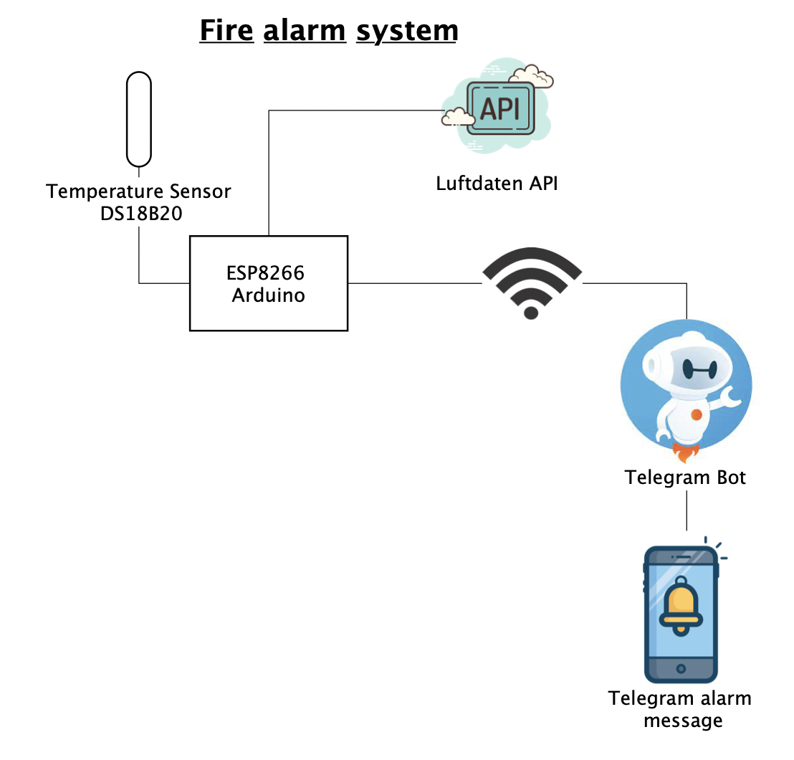
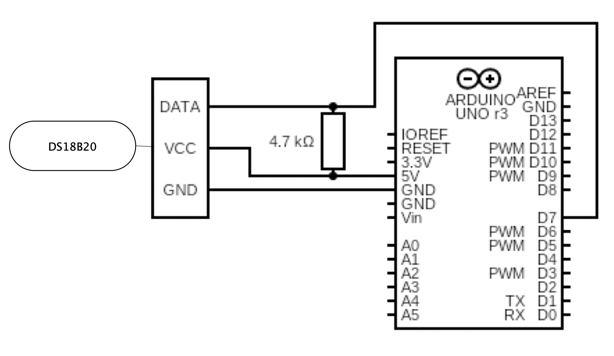
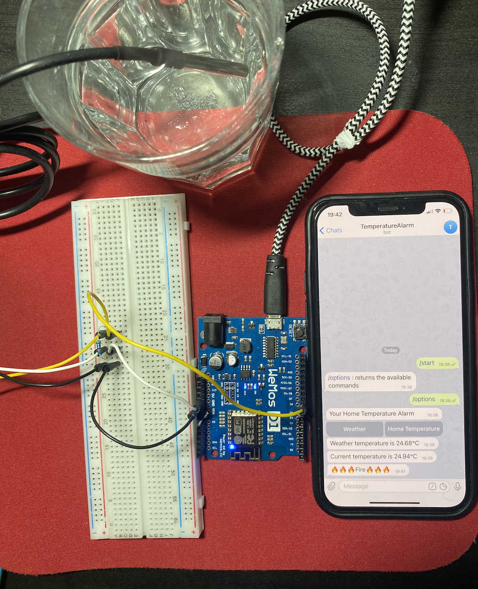

# Fire-alarm-system
Fire alarm system with Arduino and DS18B20 temperature sensor. The system is based on measuring the temperature inside and outside the room. When the indoor temperature exceeds the outdoor temperature with a certain limit, it notifies the user via Telegram Bot that something is wrong so that the user can act quickly. 
The user can also check the current room temperature or the current temperature in his place via Telegram Bot.

### Circuit Diagram

### Final System

